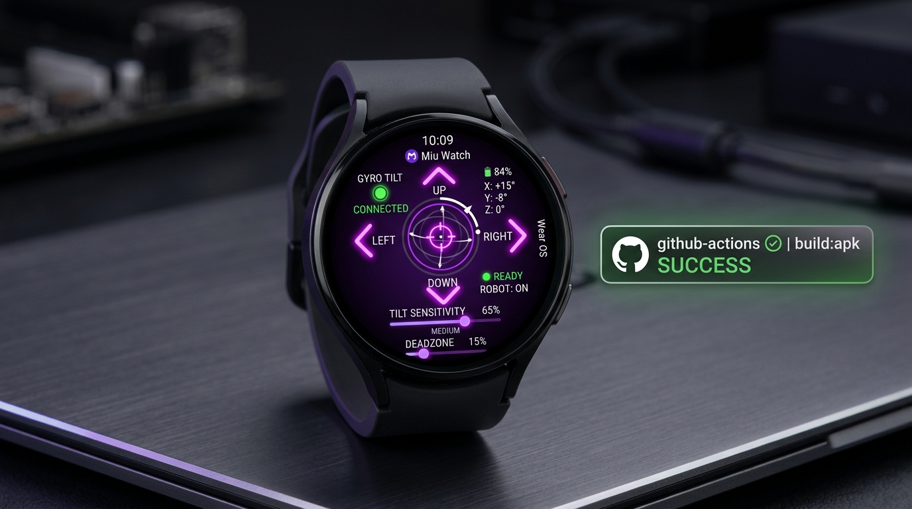

# Miu Watch — Wear OS Sensor Controller ⌚🤖


<p align="center">
  
</p>

A native **Wear OS / Galaxy Watch 6** companion application for controlling the **Miu Robot**. Streams hardware sensor orientation (`Rotation Vector`) directly into Miu's motor control loop via local Wi-Fi without browser sandbox limitations.

---

## 🌟 How It Works

```
Galaxy Watch (Wear OS)
  ├── WebView ───> http://192.168.4.1 (Miu ESP32 Web Interface)
  └── SensorManager (Rotation Vector)
        └── Every 100ms ───> injects handleTilt({beta, gamma})
                                    │
                                    └──> ESP32  GET /cmd?go=forward
```

- Injects sensor values into the embedded web controller using `handleTilt()`.
- Zero firmware modifications required on the robot.

---

## 🚀 Building the APK

### Method 1: Automatic GitHub Actions Build (Recommended)
This repository includes a ready-to-use GitHub Actions workflow (`.github/workflows/build.yml`):

1. Push this repository to GitHub.
2. Go to the **Actions** tab on your GitHub repo.
3. The **"Build Miu Watch APK"** workflow runs automatically on each commit.
4. Download `miu-watch-debug-apk.zip` from the **Artifacts** section to get `app-debug.apk`.

### Method 2: Local Gradle Build
```bash
./gradlew assembleDebug
# Output: app/build/outputs/apk/debug/app-debug.apk
```

---

## 📲 Sideloading APK to Galaxy Watch / Wear OS

### Step 1: Enable Developer Options on Watch
1. On Watch: Go to **Settings → About Watch → Software info**.
2. Tap **Software version** 7 times until Developer Mode is activated.

### Step 2: Enable Wireless ADB
1. Go to **Settings → Developer options**.
2. Turn **ADB debugging** ON.
3. Turn **Wireless debugging** ON.
4. Note the IP address and port (e.g. `192.168.1.42:5555`).

*(Ensure PC and Watch are connected to the same Wi-Fi network)*.

### Step 3: Install via ADB
```bash
adb connect 192.168.1.42:5555
adb install app-debug.apk
```

---

## 🎮 Usage

1. Open **Miu Watch** on your smartwatch.
2. Connect your watch Wi-Fi to Miu (`miu-controller` / `192.168.4.1`).
3. Select **Tilt Mode**.
4. Tilt your wrist to navigate Miu in real time!

---

## 📄 License

Distributed under the [MIT License](LICENSE).
